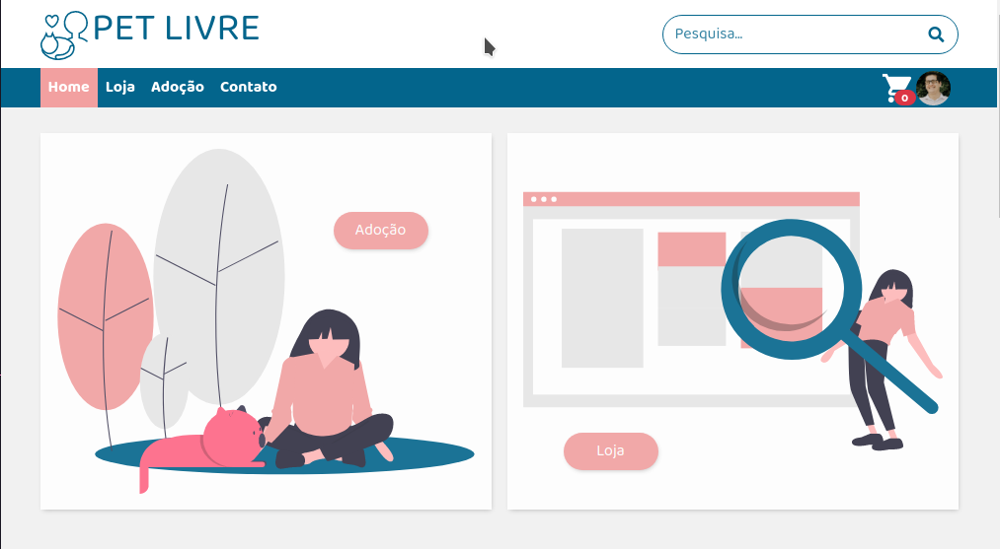
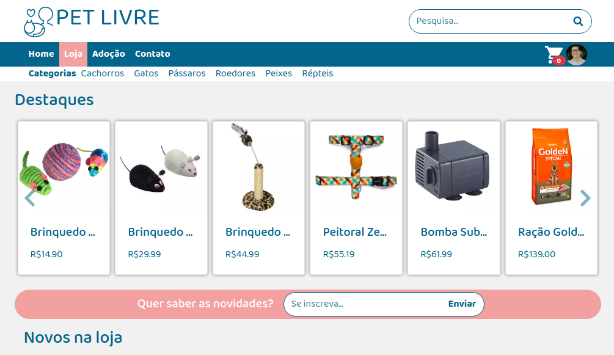
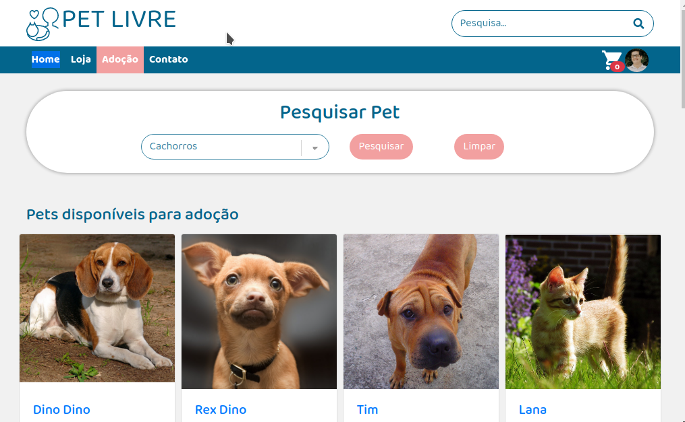
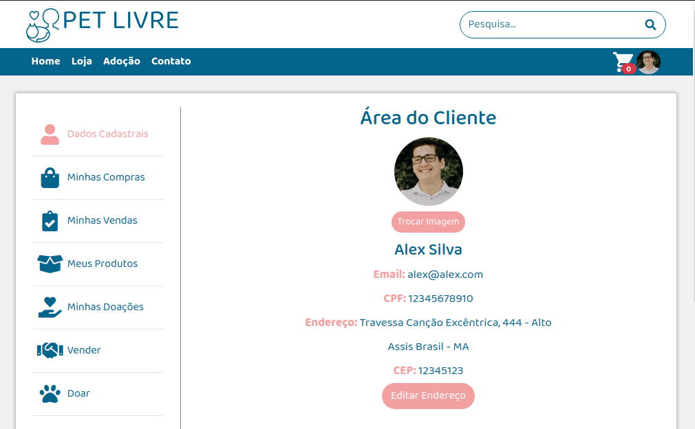

# 

Projeto integrador apresentado ao final do curso na Digital House.

### Para acessar o projeto online acesse: https://petlivre.herokuapp.com/

  
  
  
  

## Instalação

Clone o projeto

`git clone https://github.com/alexsilva11/projeto-integrador-3.git`

Instale as dependências:

`npm install` ou `yarn`

Crie um banco de dados MySql localmente e configure as variáveis de ambiente no arquivo .env (Há um exemplo no projeto ".env.example")

Após criar o banco de dados execute as migrations

`npx sequelize-cli db:migrations:run` ou `yarn sequelize-cli db:migrations:run`

Após executar as migrations rode as seeders para inserir dados nas tablelas

`npx sequelize-cli db:seed:all` ou `yarn sequelize-cli db:seed:all`

Finalmente, para rodar o projeto basta dar o comando:

`npm start` ou `yarn start`

e acessar no seu navegador http://localhost:3000

## Construído com

Node.js
Express
Ejs
